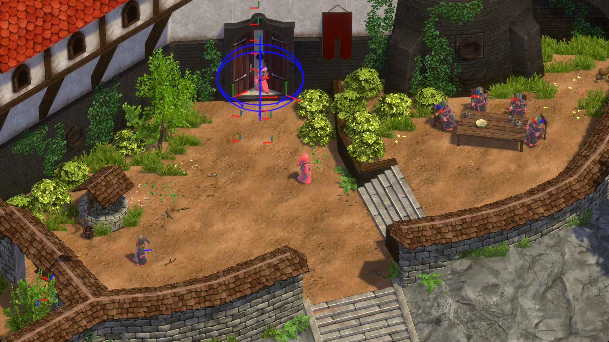

**MAGICKA® is the property of Paradox Interactive AB.** This project is not associated with or endorsed by Paradox Interactive or Arrowhead Game Studios. See [LICENSE.md](./LICENSE.md).

---

A project to give Magicka players an easier way to experiment with gameplay and content creation, and better modern platform hardware support including Linux/Vulkan. It directly reads your original installed assets from your legal copy of Magicka. You must obtain Magicka from Paradox Interactive.

## Notes
You need to set the `MAGICKA_CONTENT_DIR` environment variable to the path of the *Content* directory in your Magicka install.

## Interests/goals
- Sandbox mode
- Online servers with more than 4 players, including campaign and arena
- Spell system experimentation and rebalancing. What would it be like to play through Magicka with on-release Wizard Wars balance?
- Easier modding?

## Development
[Bevy](https://bevy.org) is used for ECS, rendering, etc.
